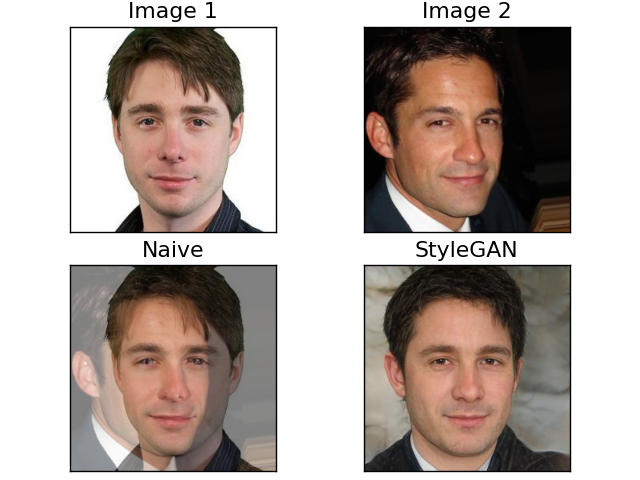

# Face Oversampling
This repository contains the source code used in the paper **Fighting Ageism in datasets:How not to oversample images using GANs**.

## Problem statement
The age distribution in dataset (IMDB and UTK Face) is uneven. The  amount  of  images  for  20-30  year  old  fairly exceeds other age groups. 
Many authors compare their models’ predictions using metrics such as Mean Absolute Error (when the problem of age estimation is solved as a regression problem).   
Such metrics are not fit to be used with imbalanced data, as they do not take the size of a given age group into consideration, 
causing the models to be really good at predicting the age of people between 20 and 40, but failing to correctly predict other age groups. 

## Methodology
We propose to implement an oversampling method, adapting a very well known SMOTE method to process face images.
The other approach is to operate in latent space rather than on a pixel level. Previous research has proven that it is 
possible for a neural network to learn a high-level representation of a face, recognising features like hair and skin colour, faceshape, age etc.

The pretrained  version  of  Pixel2Style2Pixel,  which  is  image  to  image  translation  framework build upon StyleGan2,
was used for the face interpolation task.  To measure the quality of oversampling we compare the results of the light model, namely MobileNetV2.

Face oversampling is implemented as follows. At each step,  oversampling  is  performed  on  two  images  drawn  at random 
from  the  same  age  group  (this  refers  to  sampling neighbours in SMOTE). Then, we propagate the first image through 
pSp to obtain the latent space, which is then injected into the second image. The contribution of the injected latent space 
to the output image is selected randomly between 0.1 and 0.9. The newly obtained latent space is passed through a generator, 
which produces a photo-realistic output image. The oversampling is performed until each age group count is bigger than the average group size.
It  allows  us  to  oversample  the  minority  age  groups, while the majority age groups remain unchanged. 

Example of face interpolation (with equal contribution of each face):

## Evaluation
To measure  the  quality  of  the  model’s  predictions  by  considering each class equally we used Weighted MAE:

where $`w_i`$ indicated the weight of a sample defined as $`\frac{number\_of\_samples}{number\_of\_age\_groups*group_i\_size}`$

## Results
| **Model** | **UTK Face** | **IMDB Wiki** |
| ------- | --- | --- | 
Baseline  | 8.16  |  11.77  
Naive Sampling  |  8.01  |  11.53
GAN Face Interpolation  | 8.01  |  12.25 

The results are unsatisfying. In the case of UTK dataset, the model performed as well as the naive approach, while for IMDB it even performed worse than the baseline! At the moment we explain this as an over-generalization of the SMOTE algorithm.

## More visualizations of mixing faces with StyleGan 
#### Simple blending

#### Simple blending high level features
 
#### Simple blending low level features
 
### Injecting random face
A central face (equal contribution of both faces) was selected from simple blending, to which a random face was added, 
with high or low level features.

## Example blending with random face added to vary output
